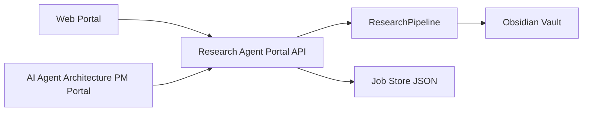

# Portal Integration

Research Agent를 CLI 밖에서 실행하려면 포탈이 호출할 수 있는 얇은 JSON Runtime API를 먼저 띄운다.
이 API는 별도 웹포탈과 `AI Agent Archtecture`의 PM Portal/BFF가 모두 사용할 수 있도록 `/runs`, `/jobs`, `/vault-health`, `/next-actions` 표면을 제공한다.
실행 순서, smoke 검증, 장애 진단은 [portal-runbook.md](portal-runbook.md)를 따른다.

## Requirements

1. 일반 웹포탈에서 Research Agent를 실행한다.
2. `AI Agent Archtecture`에서 만들어진 포탈에서 Research Agent를 실행한다.

두 요구사항의 공통점은 포탈이 Python CLI 내부를 직접 import하지 않고 HTTP JSON API만 호출해야 한다는 점이다.
따라서 Research Agent는 실행 엔진과 포탈 UI 사이에 `serve-portal-api`를 둔다.



## Start Research Agent Portal API

개발 중에는 설치 없이 `PYTHONPATH=src`로 실행한다.

```bash
cd "/Users/minsungkim/Documents/Research Agent"

PYTHONPATH=src python3 -m research_agent \
  --vault "/Users/minsungkim/Documents/Obsidian Vault" \
  serve-portal-api \
  --host 127.0.0.1 \
  --port 8780
```

공유 환경에서는 bearer token을 켠다.

```bash
export RESEARCH_AGENT_PORTAL_TOKEN="replace-me"

PYTHONPATH=src python3 -m research_agent \
  --vault "/Users/minsungkim/Documents/Obsidian Vault" \
  serve-portal-api \
  --host 127.0.0.1 \
  --port 8780 \
  --auth bearer
```

## API Surface

브라우저에서 `http://127.0.0.1:8780/`을 열면 한글 기본 웹포탈 화면을 사용할 수 있다.
이 화면은 주제, provider, 드라이런/오프라인, 논문 수를 입력하고 job 상태와 결과 JSON을 확인하는 최소 운영 콘솔이다.

| Method | Path | Purpose |
| --- | --- | --- |
| `GET` | `/` | 기본 Research Agent 웹포탈 UI |
| `GET` | `/health` | API readiness. Auth 없이 확인 가능 |
| `GET` | `/doctor` | Research Agent 설정 상태를 JSON으로 확인 |
| `GET` | `/vault-health` | Vault 운영 상태를 JSON으로 확인 |
| `GET` | `/next-actions` | 다음 유지보수 작업 queue 확인 |
| `GET` | `/job-store-health` | Portal job store 크기, 상태별 count, cleanup preview 확인 |
| `POST` | `/runs` | research run을 background job으로 등록 |
| `GET` | `/jobs` | job 목록 |
| `GET` | `/jobs/{job_id}` | job 상태와 결과 |
| `GET` | `/runs` | 완료된 run 목록 |
| `GET` | `/runs/{run_id}` | 완료된 run summary |

`POST /runs`는 일반 웹포탈용 `topic`과 AI Agent Architecture 호환용 `objective`를 모두 받는다.

```json
{
  "topic": "OpenAI Agents SDK와 LangGraph 비교",
  "provider": "gemini",
  "offline": false,
  "dry_run": false,
  "max_papers_per_source": 2
}
```

AI Agent Architecture PM Portal은 기본적으로 다음처럼 `objective`만 전달한다.

```json
{
  "objective": "Review official docs and papers for OpenAI Agents SDK vs LangGraph"
}
```

## Web Portal Flow

내장 웹포탈은 `/`에서 바로 사용할 수 있다. 별도 웹포탈을 만들 때도 같은 순서로 붙인다.

1. `GET /health`로 API 상태 확인
2. `GET /doctor`로 Vault/provider/key 상태 표시
3. `GET /job-store-health?retention_days=90&retention_limit=200`으로 job store cleanup preview 표시
4. 사용자가 topic, provider, offline/dry-run 여부 입력
5. `POST /runs`로 job 생성
6. `GET /jobs/{job_id}` polling
7. 완료 후 `paths.run_note`, `paths.evidence_ledger`, `paths.service_blueprint`, `paths.topic_map`을 포탈에 링크
8. `GET /vault-health`, `GET /next-actions`로 후속 작업 표시

예시:

```bash
curl -sS http://127.0.0.1:8780/health
curl -sS "http://127.0.0.1:8780/job-store-health?retention_days=90&retention_limit=200"

curl -sS -X POST http://127.0.0.1:8780/runs \
  -H "Content-Type: application/json" \
  -d '{"topic":"agentic RAG 구조 분류","dry_run":true,"offline":true}'

curl -sS http://127.0.0.1:8780/jobs/<job_id>
```

Bearer auth를 켠 경우 내장 웹포탈의 `Bearer 토큰` 필드에 토큰을 넣으면 이후 API 요청에 `Authorization` header가 붙는다.

## AI Agent Architecture Portal Flow

`AI Agent Archtecture`의 PM Portal은 이미 runtime upstream으로 `POST /runs`와 `GET /jobs`를 호출한다.
Research Agent Portal API가 같은 경로를 제공하므로 `--pm-portal-runtime-url`만 Research Agent API로 바꾸면 된다.

```bash
cd "/Users/minsungkim/Documents/AI Agent Archtecture"

PYTHONPATH=src python3 -m supervisor_graph_hybrid \
  --serve-pm-portal \
  --pm-portal-host 127.0.0.1 \
  --pm-portal-port 8770 \
  --pm-portal-runtime-url http://127.0.0.1:8780
```

이 경우 PM Portal의 scenario/objective 실행은 Research Agent의 research topic 실행으로 들어간다.
PM Portal BFF는 Research Agent 호환 실행 옵션인 `provider`, `offline`, `dry_run`, `max_papers_per_source`를 `/runs` payload에 함께 전달한다. PM Portal 화면의 실행 옵션에서 provider와 dry-run/offline 여부를 고르면 Research Agent Portal API가 같은 값을 사용한다.
PM Portal의 `리서치 드라이런` preset은 `gemini`, `offline`, `dry_run`, paper count 1로 맞추고, `리서치 실사용` preset은 `auto`, online, live, paper count 2로 전환한다.
PM Portal의 `리서치 실행` 섹션은 두 preset, 최근 Research job, job store 상태를 한 화면에 묶는다. 최근 job은 상태별로 필터링할 수 있고, 실패 job은 보존된 topic/objective와 실행 옵션으로 재실행할 수 있다. 재실행 job은 원본 job ID를 `rerun_of`로 저장해 포털과 job store에서 이력을 추적한다. live run인 경우 Obsidian run log와 topic map frontmatter에도 `rerun_of`가 남고, 본문에는 원본/한글 병기 `Run Lineage` 섹션이 추가된다. 같은 `rerun_of`를 가진 run log와 topic map은 `backlink-proposals`에서 score 6 lineage 후보로 노출되고, Research Agent 웹포털의 `후속 작업` 패널에도 next-actions 항목으로 표시된다. PM Portal은 Research Agent runtime의 `/job-store-health`를 `/api/job-store-health`로 프록시해 작업 저장소 총량과 cleanup preview를 이 섹션과 현황판에 함께 표시한다.

## E2E Smoke Test

PM Portal과 Research Agent Portal API를 함께 띄워 실제 연동을 확인하려면 smoke 스크립트를 사용한다. 스크립트는 두 서버를 로컬 포트에 기동하고, PM Portal의 `/api/runs`로 `dry_run: true`, `offline: true` 요청을 보낸 뒤 job 완료와 planned artifact 반환을 확인한다. 마지막에는 서버를 종료하고, planned artifact가 Vault에 실제 생성되지 않았는지도 검사한다.

```bash
cd "/Users/minsungkim/Documents/Research Agent"

python3 scripts/portal_e2e_smoke.py \
  --vault "/Users/minsungkim/Documents/Obsidian Vault" \
  --ai-portal-root "/Users/minsungkim/Documents/AI Agent Archtecture"
```

포트가 이미 사용 중이면 `--auto-port`로 빈 포트를 자동 선택한다.

```bash
python3 scripts/portal_e2e_smoke.py --auto-port
```

고정 포트가 필요할 때만 `--research-port`와 `--pm-portal-port`를 직접 지정한다.

기본 smoke는 Vault에 쓰지 않는다. 온라인 collector 호출까지 확인해야 할 때만 `--online`을 추가한다.

공유 포탈에 가까운 인증 경로까지 확인하려면 bearer smoke를 실행한다. 토큰은 `RESEARCH_AGENT_PORTAL_E2E_TOKEN` 환경변수에서 읽고, 없으면 실행 중 임시 토큰을 생성한다. 토큰은 명령행 인자로 넘기지 않고 두 서버의 환경변수로만 주입된다.

```bash
python3 scripts/portal_e2e_smoke.py --auth bearer
```

전체 단위 테스트와 포탈 smoke를 같은 흐름에서 검증하려면 local check 스크립트를 사용한다.

```bash
python3 scripts/check.py --include-portal-smoke --portal-smoke-auth bearer --portal-smoke-auto-port
```

재실행 lineage와 Obsidian backlink 적용 workflow만 빠르게 확인하려면 임시 Vault 기반 smoke를 실행한다. 이 smoke는 Research Agent Portal API adapter에 live offline run을 등록하고, `Run Lineage` 산출물, `next-actions` 후보, `backlink-proposals --apply`, checked `apply-reviewed-backlinks`까지 확인한다.

```bash
python3 scripts/rerun_lineage_smoke.py
python3 scripts/check.py --include-rerun-lineage-smoke
```

CI에서 포탈 서버 기동 없이 전체 단위 테스트만 확인하려면 `--ci`를 사용한다.

```bash
python3 scripts/check.py --ci
```

개발 중 빠른 확인은 포탈 smoke를 제외한 핵심 단위 테스트 subset만 실행한다.

```bash
python3 scripts/check.py --quick
```

이미 두 포탈 서버가 떠 있다면 UI static asset smoke로 Research form, PM runtime option, Research preset wiring을 확인한다.

```bash
python3 scripts/portal_ui_smoke.py \
  --research-url http://127.0.0.1:8780 \
  --pm-url http://127.0.0.1:8770
```

## Job Store Retention

Portal API의 기본 job store는 Vault의 `60_Runs/research_portal_jobs.json`이다. 오래된 terminal job을 정리하려면 먼저 preview를 실행한다.

```bash
PYTHONPATH=src python3 -m research_agent \
  --vault "/Users/minsungkim/Documents/Obsidian Vault" \
  portal-job-cleanup \
  --retention-days 90 \
  --retention-limit 200
```

검토 후 실제 JSON store를 갱신하려면 `--apply`를 붙인다.

```bash
PYTHONPATH=src python3 -m research_agent \
  --vault "/Users/minsungkim/Documents/Obsidian Vault" \
  portal-job-cleanup \
  --retention-days 90 \
  --retention-limit 200 \
  --apply
```

서버 자동 retention은 명시적으로 켠다. 기본값은 `0`이라 자동 prune은 비활성화되어 있다.

```bash
PYTHONPATH=src python3 -m research_agent \
  --vault "/Users/minsungkim/Documents/Obsidian Vault" \
  serve-portal-api \
  --job-retention-days 90 \
  --job-retention-limit 200
```

## Safety Notes

- `dry_run: true`는 Obsidian 산출물 생성 예정 경로만 반환한다.
- 실제 `run`은 Obsidian Vault에 source note, evidence ledger, service blueprint, topic map, run log를 쓴다.
- 포탈 공유 환경에서는 `--auth bearer`를 사용한다.
- job store는 기본적으로 Vault의 `60_Runs/research_portal_jobs.json`에 저장된다.
- smoke의 임시 job store는 `/private/tmp/research-agent-e2e-*.json`에 두고 기본적으로 삭제한다.
- portal job cleanup은 `completed`, `failed`, `cancelled`, `interrupted` job만 prune하고 `queued`, `running` job은 보존한다.
- 장기 실행 API는 `--max-workers 1` 기본값을 유지해 Vault 동시 쓰기를 피한다.
